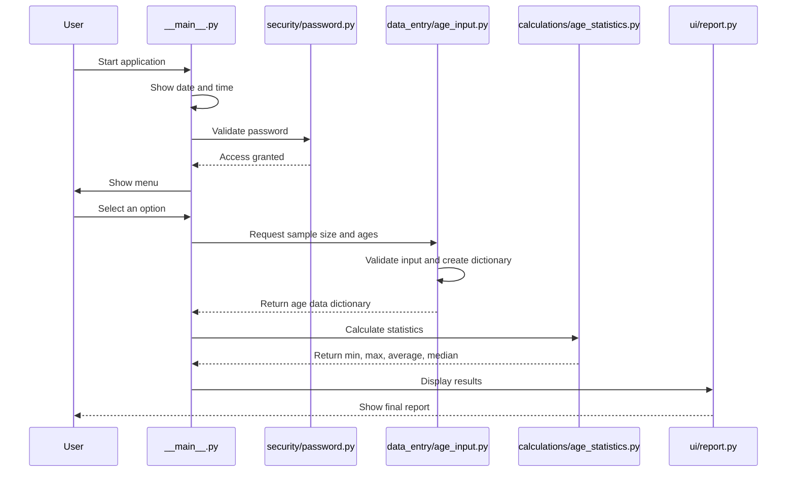

# SOFT-645 Final Project

Console application for calculating age statistics for San Pascualin School.

The program asks for a sample size, stores student ages, validates the data, and shows basic statistics such as minimum age, maximum age, average age, and median age.

## Project idea

The company DataByte hired us to create a Python program that calculates statistics from a sample of student ages.

The application must:

- Display the date and time when the application starts.
- Ask for a secure password before showing the menu.
- Ask for the sample size.
- Store student ages in a list.
- Validate the entered data.
- Calculate the highest and lowest age.
- Calculate the average age with one decimal.
- Calculate the median age.
- Use `def` functions for the main operations.
- Provide a console menu with input validations.

## Project structure

```text
soft-645-fundamentos-python-proyecto-final/
├── ProyectoEnunciado.pdf
├── README.md
├── requirements.txt
└── school_age_statistics/
    ├── __init__.py
    ├── __main__.py
    ├── calculations/
    │   ├── __init__.py
    │   └── age_statistics.py
    ├── data_entry/
    │   ├── __init__.py
    │   └── age_input.py
    ├── security/
    │   ├── __init__.py
    │   └── password.py
    └── ui/
        ├── __init__.py
        └── report.py
```

## Architecture



The menu is handled directly in `__main__.py`.

## Data format

The data entry module returns a simple dictionary with this structure.

```python
{
    "sample_size": 3,
    "ages": [10, 12, 11],
}
```

## Team responsibilities

```text
JOEL - Main / Integration
└── school_age_statistics/__main__.py
```

```text
ESTEBAN - Security
└── school_age_statistics/security/password.py
```

```text
JONATHAN - Data Entry + Validation
└── school_age_statistics/data_entry/age_input.py
```

```text
SEBASTIAN - Calculations
└── school_age_statistics/calculations/age_statistics.py
```

```text
PAOLA - UI / Reports
└── school_age_statistics/ui/report.py
```

## Collaboration rules

- Each person should mainly work inside their assigned file or folder.
- Avoid editing another person's files unless the team agrees first.
- The main integration should happen in `school_age_statistics/__main__.py`.
- Code names should be written in English, but user-facing messages should be written in Spanish.
- The data entry person is responsible for returning validated data.
- The calculations person should not ask for user input.
- The UI person should not calculate statistics.
- The security person should only handle password-related logic.
- Next update on July 6th.

## How to run the application

The application will be executed as a Python module:

```bash
python -m school_age_statistics
```

## Dependency plan

This project currently uses only the Python standard library.

If a dependency is added later, it should be documented in `requirements.txt`.
